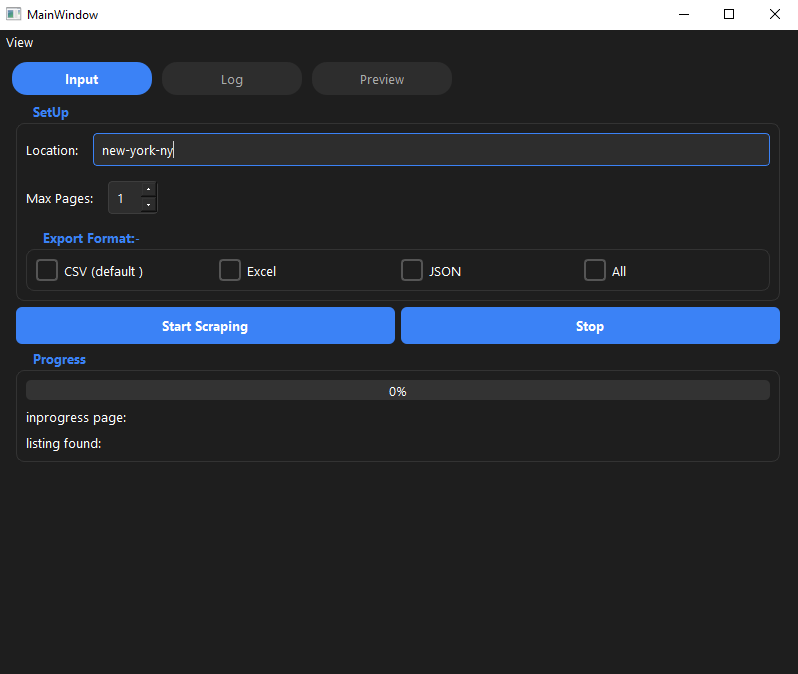
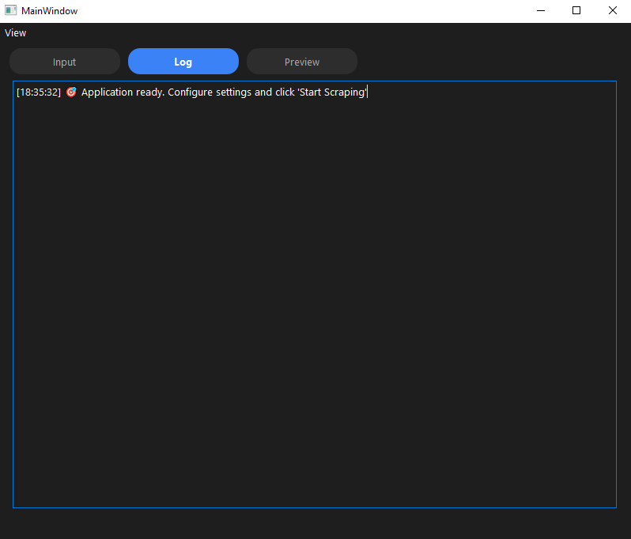
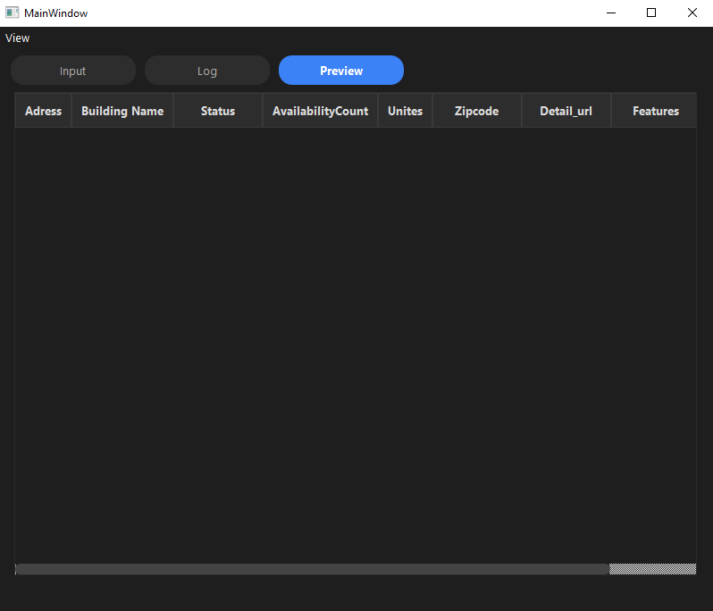

# 🏠 Zillow Rental Scraper

A powerful desktop application built with PySide6 to scrape rental listings from Zillow. Features a modern GUI with dark mode, real-time progress tracking, and multi-format export capabilities.


---

## ✨ Features

- 🖥️ **Modern GUI Interface** - Clean, intuitive desktop application
- 🌙 **Dark Mode** - Toggle between light and dark themes
- 📊 **Real-time Progress** - Live updates during scraping
- 🔄 **Multi-threaded** - Non-blocking UI, responsive during scraping
- 💾 **Multiple Export Formats** - Save as CSV, Excel, or JSON
- 📝 **Detailed Logging** - Track every step of the scraping process
- 🛑 **Stop Anytime** - Cancel scraping mid-process
- 📍 **Location-based Search** - Scrape any Zillow location
- 🏢 **Rich Data Extraction** - Address, units, features, photos, and more

---

## 📸 Screenshots







---


## 📖 Usage


   ```bash
   git clone https://github.com/a8392280-web/zillow-scraper.git
   cd zillow-scraper
   pip install -r requirements.txt
   python main.py
   ```


### Basic Workflow

1. **Enter Location** - Type a Zillow-compatible location (e.g., `brooklyn-ny`, `manhattan-ny`)
2. **Set Max Pages** - Choose how many pages to scrape (1-50)
3. **Select Export Formats
4. **Start scraping
